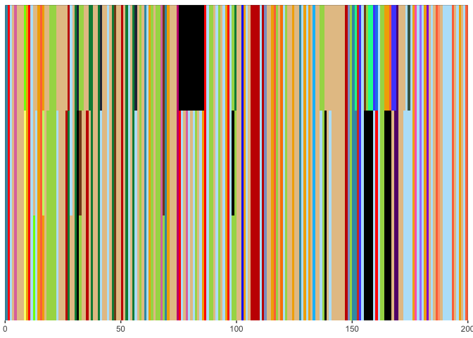

<!-- README.md is generated from README.Rmd. Please edit that file -->

# analyzeRepeatSequences

<!-- badges: start -->

<!-- badges: end -->

This package involves:

- Visualizing a multiple sequence alignment of repetitive sequences.
- Summarizing a multiple sequence alignment into stacked bar plot of
  repeat unit frequencies.
- Calculating a consensus sequence from related sequences.
- Determining variable segments of repetitive sequences.

Steps preceding use of this package: 1. Run Tandem Repeats Finder
<https://tandem.bu.edu/trf/trf.html> to identify input sequences. 2.
Parse repetitive sequences into repeat units. 3. Group infrequent repeat
units into single categories. 4. Convert each repeat unit to a single
character. 5. Perform multiple sequence alignment. 6. Convert alignment
to table according to format below.

The output table from step 6 above has the following format:

        unitorders_df
        
        A parsed multiple sequence alignment. Each row is one repeat unit. Rows 
        are ordered by individual.
        Within an individual, rows are ordered from bottom to top in the 5' to 3' 
        direction.
        
        Columns:
              character: repeat unit encoded as a single ASCII character 
              (character)
              sample: individual sequence ID (character)
              count: width of each repeat unit on the plot (numeric)
              seq: sequence of repeat unit (character)
              gp: integer that increments one every row over the ungrouped
              dataframe. This gives every repeat unit in a sequence its own 
              position, rather than clustering identical units together (integer)
              group: used with plotSubgroups = T to cluster sequences in the plot
        

This data is accompanied by several accessory datasets specific for a
VNTR in CACNA1C.

        unit_frequency_df
        
        Table of repeat unit frequencies with no grouping of infrequent repeat
        units.
        
        Columns:
              seq: sequence of repeat unit (character)
              length: length in nucleotides of repeat unit (integer)
              count: count of repeat unit observed in all sequences (integer)
              Frequency: Frequency of repeat unit abundance among all repeat units (numeric)
              samples: Comma-separated list of samples with at least one copy of repeat unit (character)
              num_samples: Count of samples with at least one copy of repeat unit (integer)
              frac_samples: Fraction of total samples with at least one copy of the repeat unit (numeric)


        unit2ascii_df
        
        Conversion table for repeat units represented by single characters.

        Columns:
          seq: sequence of repeat unit (character)
          character: repeat unit encoded as a single ASCII character (character)


        unit2color_df
        
        Conversion table for repeat units represented by unique color.

        Columns:
          seq: sequence of repeat unit (character)
          color: Hex color (character)

All data.frames used in this repository have an example in data/
directory.

## Citation

R. Moya, X. Wang, R. W. Tsien, M. T. Maurano, Structure of a polymorphic
repeat at the CACNA1C schizophrenia locus. PNAS (2025). Available at:
<https://doi.org/10.1073/pnas.241565012>

## Installation

You can install the development version of analyzeRepeatSequences from
[GitHub](https://github.com/) with:

``` r
# install.packages("devtools")
devtools::install_github("ramoya/analyzeRepeatSequences")
```

## Quick example

Example visualization of a multiple sequence alignment. Each color is a
unique repeat unit. Alignment gaps are shown in black.

    #> Joining by: seq


